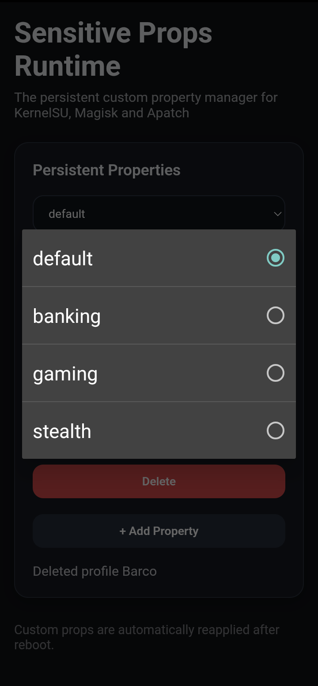
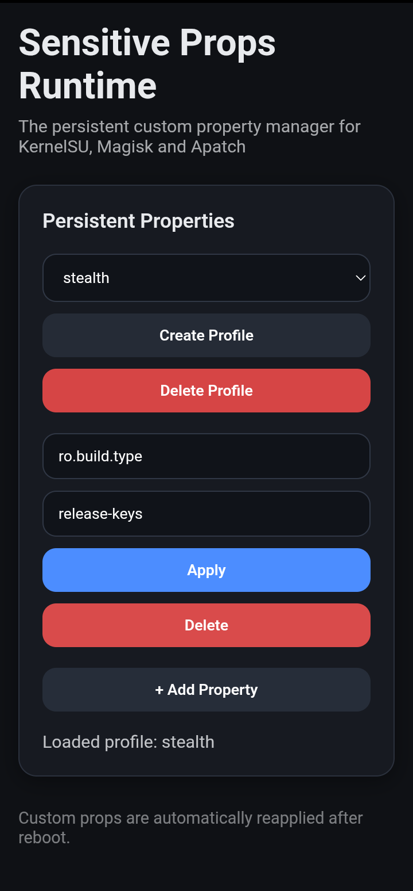
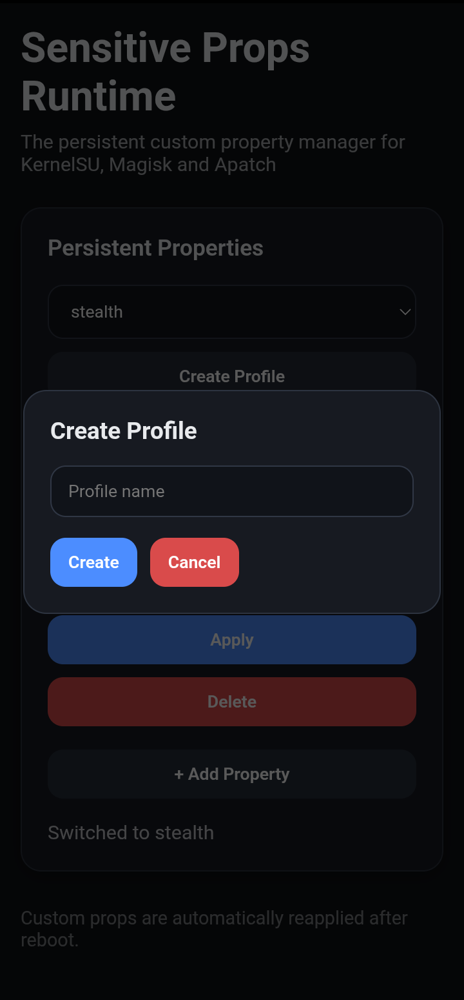

# Sensitive Props Runtime

> Runtime Android property orchestration with persistent profiles, live resetprop management and KernelSU WebUI integration.

Interactive **runtime fork** of sensitive-props for **KernelSU**.

Sensitive Props Runtime **extends** the original sensitive-props project with persistent property profiles, **live property** editing, **KernelSU WebUI integration** and **runtime resetprop orchestration**.

Instead of limiting property **modifications** to boot-time execution, **properties can be managed interactively** and **persisted** across reboots.

## Requirements
- KernelSU [latest release](https://github.com/tiann/KernelSU/releases/latest).
## Installation

### KernelSU

1. **Download** the **Sensitive Props Runtime** [latest release](https://github.com/MrAnimo/Sensitive-Props-Runtime/releases/latest).
2. Open KernelSU **Manager**.
3. **Install** the ZIP.
4. Reboot.
5. Open the module [**KernelSU WebUI**](https://github.com/adivenxnataly/KsuWebUI/releases/latest).


## Project Origins

This project **started** as a personal fork of Pixel-Props sensitive-props.

While the upstream project focuses primarily on property **spoofing and Play Integrity compatibility**, this fork **expands** the concept into an **interactive runtime** Android **property management** environment.

The main goals are:

* **Persistent** property profiles
* Runtime property orchestration
* Interactive **KernelSU WebUI management**
* **Live resetprop** execution
* Improved Magisk / KernelSU / APatch compatibility

while preserving the core **functionality** of the original sensitive-props project.


## Screenshots

### Profile Management

Create, delete and switch between persistent **property** profiles **directly** from the KernelSU WebUI.



---

### Runtime Property Editor

Apply, modify or remove **Android properties live** through KernelSU's JavaScript Bridge and **resetprop integration**.



---

### Profile Creation

Create new **persistent property profiles** with built-in validation and **profile management** controls.




## Features

### Runtime Property Management

* **Live** property editing
* Runtime resetprop execution
* **Immediate** property **application**
* Property **removal**

### Persistent Profiles

* **Multiple** property profiles
* Profile switching from WebUI
* **Automatic** profile persistence
* **Automatic** property replay after reboot

### KernelSU WebUI

* Create profiles
* Delete profiles
* Switch profiles
* Add **custom** properties
* Edit **existing** properties
* Remove properties
* **Runtime** execution through **KernelSU JS Bridge**

### Compatibility

* [KernelSU](https://github.com/tiann/KernelSU)
* [KernelSU Next](https://github.com/KernelSU-Next/KernelSU-Next)
* Android 11+

### Core Sensitive Props Features

* **Sensitive property cleanup** — Removes or normalizes properties commonly used to identify modified environments.
* **Custom ROM trace removal** — Cleans references to custom ROMs such as LineageOS, EvolutionX, crDroid and others from system properties.
* **Dynamic VBMeta handling** — Supports boot hash injection, VBMeta state correction and dynamic vbmeta size detection.
* **Optional resetprop-rs integration** — Provides stealth-oriented property manipulation through a Rust-based backend.
* **Device-specific fixes** — Includes adjustments for Realme, Oppo, OnePlus and Samsung devices.
* **SafetyNet / Play Integrity compatibility adjustments** — Applies property-level fixes intended to improve compatibility with integrity checks.
* **Property stealth techniques** — Supports multiple approaches for reducing property-based detection vectors.
* **Hidden API restriction cleanup** — Removes Android hidden API policy restrictions when applicable.
* **Untrusted touch protection** — Configures Android's block_untrusted_touches setting.
* **SELinux visibility hardening** — Restricts visibility of selected SELinux-related information.


## Architecture

The project is divided into **three layers**.

### Runtime Layer

Provides interactive control through KernelSU WebUI.

* **Live property** editing
* **Runtime resetprop** execution
* Profile **management**

### Persistence Layer

Stores **user-defined property profiles**.

profiles/

Example:

```
ro.build.tags=release-keys
ro.secure=1
ro.debuggable=0
```

### Boot Layer

**Reapplies** profile properties **during boot**.

* post-fs-data.sh
* service.sh
* util_functions.sh

## Profiles

**Profiles** are **stored** in:

profiles/

The **active** profile is stored in:

profiles/current_profile

Each profile is **represented** by:

profiles/<profile>.prop

Example:

```
ro.boot.verifiedbootstate=green
ro.boot.vbmeta.device_state=locked
```

## VBMeta Configuration (Optional)

For **advanced** use cases, a **custom verified boot hash** can be supplied through:

```text
/data/adb/boot_hash
```

The **file** must contain a 64-character *lowercase* SHA256 hash:

```bash
echo "your64characterlowercasehexhash..." > /data/adb/boot_hash
```

**During boot** the module will automatically:

* Set `ro.boot.vbmeta.digest`
* Set `ro.boot.vbmeta.device_state=locked`
* Set `ro.boot.vbmeta.avb_version=1.2`
* Set `ro.boot.vbmeta.hash_alg=sha256`
* **Detect vbmeta** size **dynamically**
* Support **A/B** slot devices **automatically**


### resetprop-rs (Optional but Recommended)

The module now supports [resetprop-rs](https://github.com/Enginex0/resetprop-rs) by Enginex0, a Rust-based implementation providing:

- **Stealth property deletion** without using magiskboot hexpatch
- **Better detection evasion** for SafetyNet/Play Integrity
- **Faster execution** compared to the hexpatch method

During installation, press **Vol+** within 15 seconds to auto-download resetprop-rs, or **Vol-** to skip. You can also configure this via `config.prop`:
```properties
download_resetprop_rs=true
```

## Troubleshooting

### Properties are not applied after reboot

Verify that:

* `profiles/current_profile` exists
* The **selected profile** exists in `profiles/`
* Property names are **valid Android property names**


### WebUI changes are not applied

Verify that:

* [KernelSU WebUI](https://github.com/adivenxnataly/KsuWebUI/releases/latest) is **available**
* The **KSU JavaScript** bridge is **enabled**
* `window.ksu.exec()` is **functional**

### Play Integrity still fails

**Possible** causes include:

* Device-specific **attestation behavior**
* Incorrect **property configuration**
* Missing **resetprop-rs installation**
* Additional **root-detection** vectors **outside system properties**

### Boot hash not applied

Verify that:

```text
/data/adb/boot_hash
```

contains **exactly** 64 *lowercase* hexadecimal **characters**.


## Optional Hardening

The **default configuration** aims to balance compatibility, usability and **property spoofing**.

Some **advanced** adjustments are **intentionally disabled by default**, including:

* ADB daemon status spoofing
* adb_root trace hiding
* ro.debuggable enforcement
* Periodic property cleaning

Advanced users may choose to **enable these behaviors manually** by editing the **module scripts** and configuration files.

These options are **disabled by default** to avoid **interfering** with **debugging workflows**, development **environments** and **device-specific setups**.


## WebUI

The **WebUI provides** an **interactive** Android **property management environment**.

Current capabilities:

* Create profile
* Delete profile
* **Switch** profile
* **Apply** properties
* Remove properties
* **Persist** changes
* **Reapply** after reboot


## What's New Compared To Upstream

Sensitive Props **Runtime** introduces:

* **Persistent** property profiles
* KernelSU **WebUI integration**
* Runtime property **orchestration**
* **Live property** editing
* **Active** profile persistence
* **Interactive** resetprop management
* Profile-based property **replay**


## Disclaimer

Changing Android **system properties** can affect **device behavior**.

**Always** keep backups and **understand** the implications of the **properties you modify** before **applying changes**.


## Maintained By

MrAnimo!


## Credits

### Upstream & Core Foundations

* [Pixel-Props](https://github.com/Pixel-Props) — Maintainers of the upstream sensitive-props fork this project originated from.
* **HuskyDG** — Original base and property spoofing infrastructure.
* [Enginex0](https://github.com/Enginex0) — Creator of [resetprop-rs](https://github.com/Enginex0/resetprop-rs) and contributor to VBMeta-related improvements.
* [adivenxnataly](https://github.com/adivenxnataly) — Creator of [KsuWebUI](https://github.com/adivenxnataly/KsuWebUI).

### Contributors & Community

* [T3SL4](https://t.me/T3SL4) from [PixelProps](https://t.me/PixelProps)
* [AarifZ](https://t.me/Aarifmonu)

### Related Projects

* [Magisk](https://github.com/topjohnwu/Magisk)
* [KernelSU](https://github.com/tiann/KernelSU)
* [APatch](https://github.com/bmax121/APatch)

### Additional Thanks

* All **contributors** to the original `sensitive_props` project.
* All **contributors** to Magisk, KernelSU and APatch.
* Android modding, reverse engineering and open-source **communities**.
